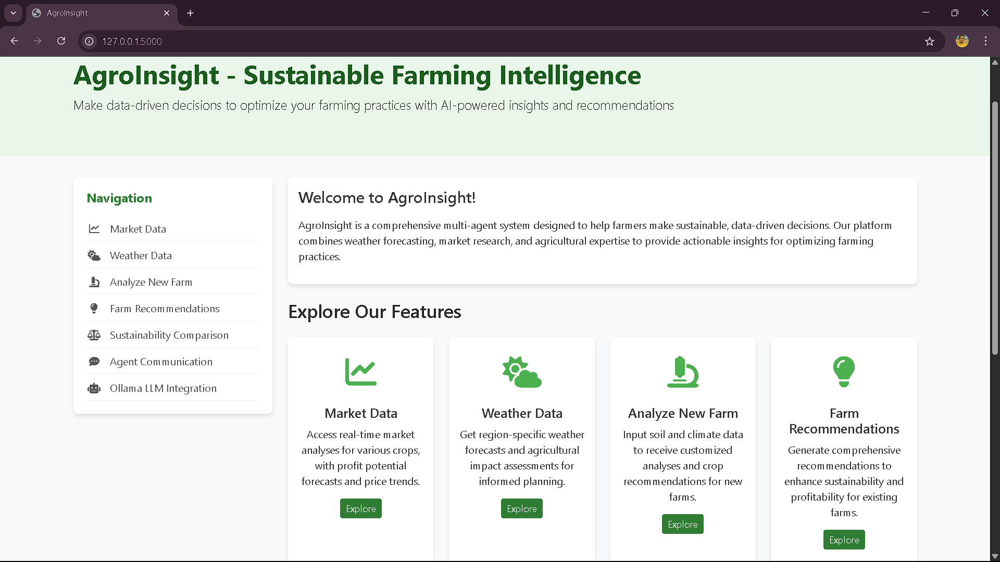
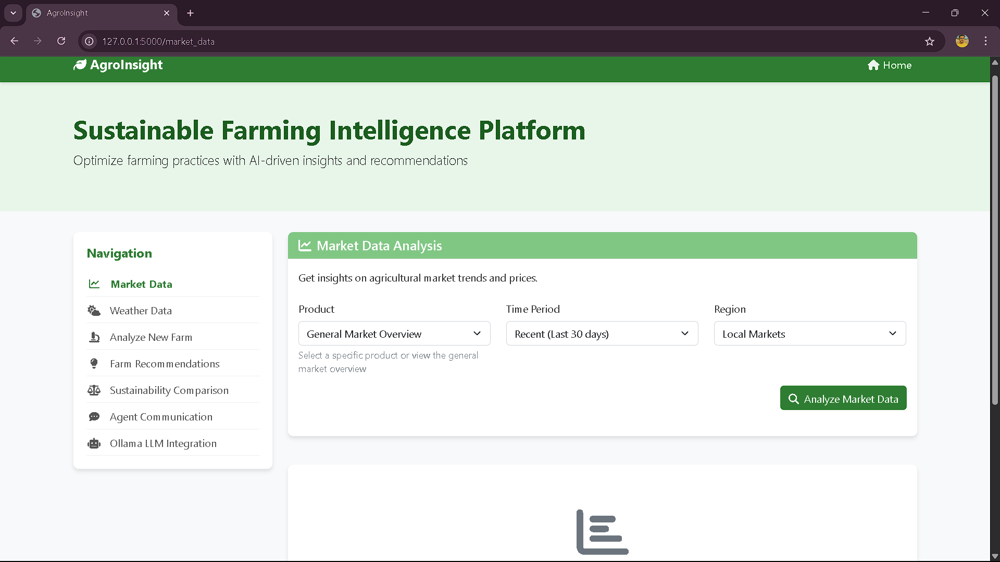
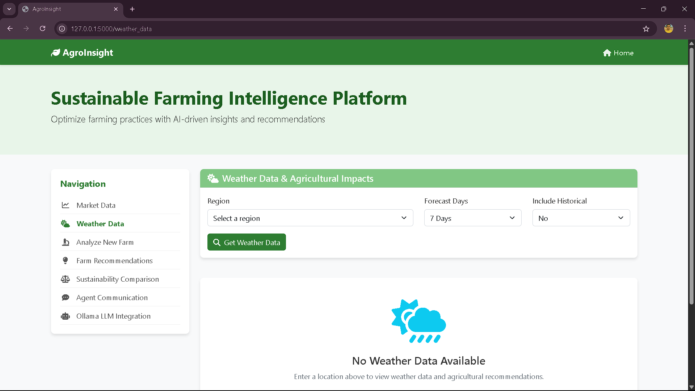
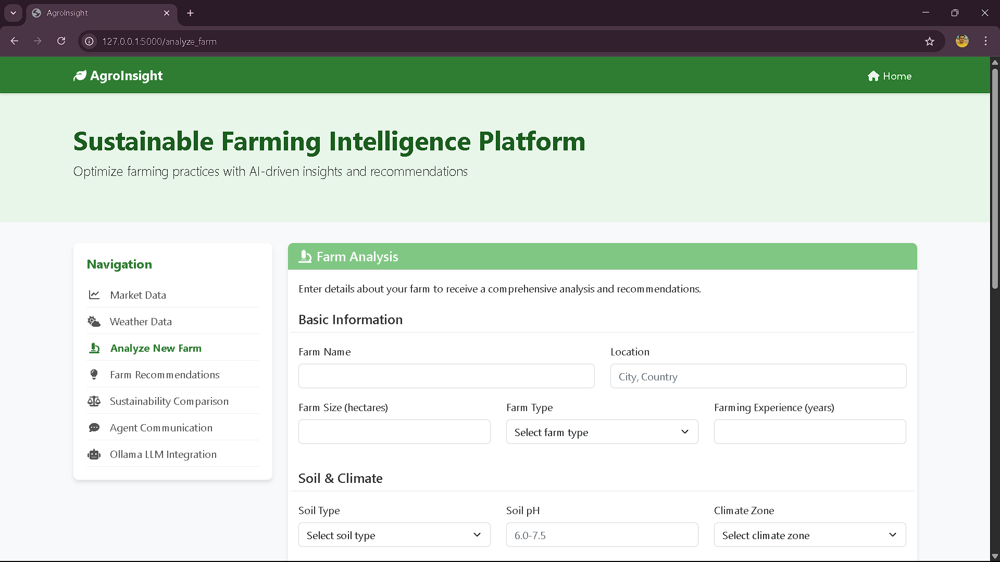
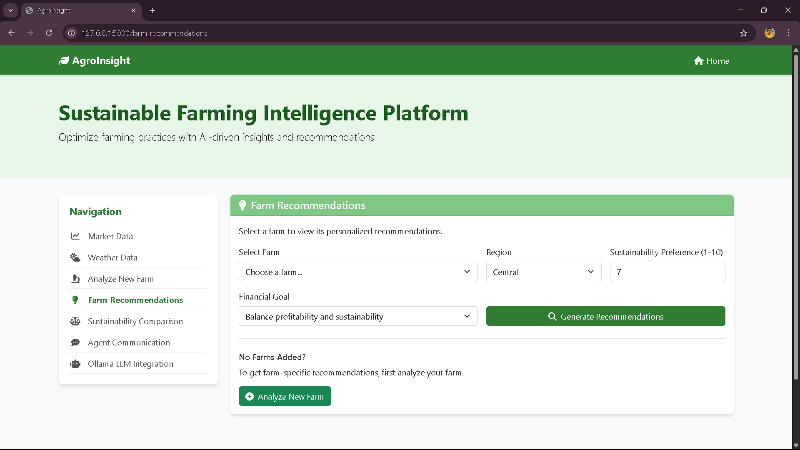
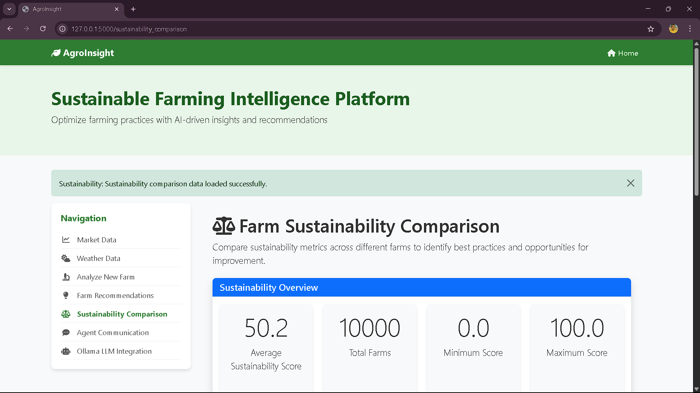
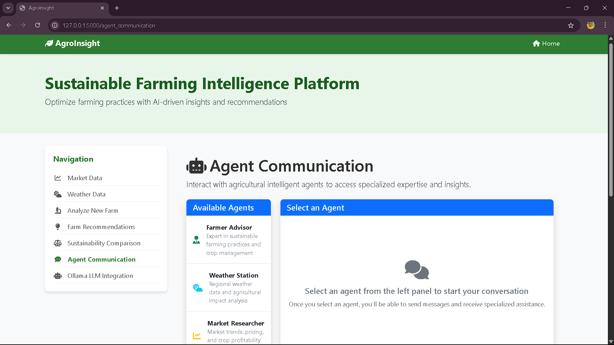
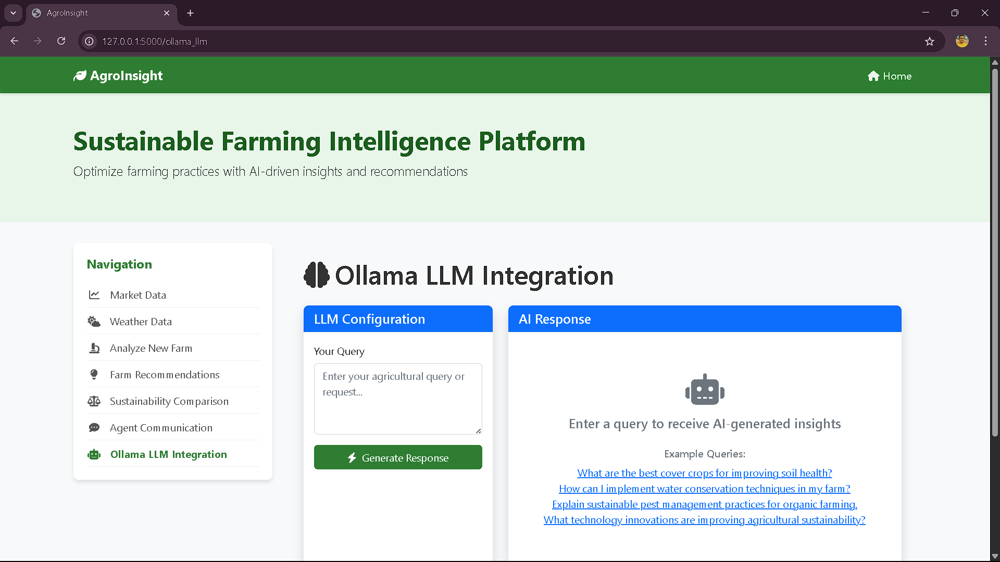

# AgroInsight: Multi-Agent AI System for Sustainable Farming

A data-driven multi-agent AI system designed to promote sustainable farming practices by bringing together farmers, weather forecasts, and market research to optimize agricultural decisions.

## Project Overview

This system combines three specialized AI agents that collaborate to provide comprehensive recommendations for sustainable farming:

1. **Farmer Advisor Agent**: Analyzes farm conditions and provides actionable insights for optimizing resource usage and improving sustainability.

2. **Market Researcher Agent**: Analyzes market trends, crop pricing, and demand forecasts to recommend the most profitable and sustainable crops to plant.

3. **Weather Station Agent**: Provides weather data and forecasts to help farmers make informed decisions about planting, irrigation, and harvesting.

4. **Ollama LLM Integration**: Enhances recommendations and analysis with the Qwen2.5 LLM hosted on a remote server.

The system features SQLite-based long-term memory that stores farm data, market information, weather patterns, and recommendations over time.

## Key Features

- **Comprehensive Farm Analysis**: Soil, climate, and farming practice analysis to identify opportunities for sustainability improvements.
- **Market Intelligence**: Real-time market analysis to help farmers select crops with the best economic and sustainability potential.
- **Weather-Driven Recommendations**: Climate-aware recommendations that consider both short-term weather events and seasonal patterns.
- **Inter-Agent Communication**: Agents communicate and share information to provide coordinated recommendations.
- **Sustainability Benchmarking**: Compare farm performance against similar farms and identify best practices.
- **Long-Term Memory**: SQLite database to track farm data, recommendations, and outcomes over time.
- **LLM-Enhanced Insights**: AI-generated insights and recommendations using the Ollama-hosted Qwen2.5 model.
- **Web Application Interface**: A modern, responsive web interface for interacting with the system, providing visualizations and interactive recommendations.
- **Personalized Farm Recommendations**: Detailed, farm-specific recommendations categorized by farming practices, market strategies, and weather adaptations.

## System Architecture

The system follows a multi-agent architecture with the following components:

- **Database Layer**: SQLite database for persistent storage of farm data, market data, and recommendations.
- **Agent Layer**: Three specialized AI agents that analyze different aspects of farming.
- **Coordination Layer**: A central system that manages communication between agents and generates unified recommendations.
- **LLM Integration Layer**: Connection to the Ollama API for enhanced natural language processing capabilities.
- **Interface Layer**: Both command-line and web interfaces for interacting with the system.

## Requirements

- Python 3.6+
- Flask (for web interface)
- pandas
- numpy
- scikit-learn
- SQLAlchemy
- matplotlib
- seaborn
- requests
- langchain
- langchain-community
- langchain-openai
- openai

## Ollama Integration

The system integrates with Ollama to provide enhanced AI-driven analysis and recommendations:

- **Server**: The Ollama server is hosted at `http://35.154.211.247:11434`
- **Model**: Qwen2.5:0.5b
- **Features**:
  - Enhanced farm analysis
  - Detailed market insights
  - Weather recommendation refinement
  - Custom agriculture-related queries

To use the Ollama integration:
1. Ensure the Ollama server is accessible
2. Run the system with the `--use-llm` flag (enabled by default)
3. Try the dedicated Ollama demo option in the main menu

## Usage

### Command-Line Interface

Run the main script to start the interactive demo:

```
python main.py
```

The demo will guide you through various features of the system:

1. **Market Data Query**: Explore market trends and pricing for different crops.
2. **Weather Data Query**: Access weather forecasts and agricultural impact assessments.
3. **New Farm Analysis**: Analyze soil and climate data for a new farm.
4. **Farm Recommendations**: Generate comprehensive recommendations for existing farms.
5. **Sustainability Comparison**: Compare sustainability metrics across farms.
6. **Agent Communication Test**: Observe how agents communicate to produce coordinated recommendations.
7. **Ollama LLM Integration Demo**: Test the AI-enhanced analysis and recommendations.

### Web Application Interface

Run the Flask web application:

```
python app.py
```

Access the web interface through your browser at `http://127.0.0.1:5000/` which offers:

1. **Dashboard**: Overview of key agricultural metrics and system capabilities.
2. **Market Data**: Interactive market trends and pricing analysis.
3. **Weather Data**: Regional weather forecasts with agricultural impact assessments.
4. **Farm Analysis**: Tools to analyze soil and climate data for new farms.
5. **Farm Recommendations**: Generate and view personalized farm recommendations with:
   - High-priority actions
   - Farming practice recommendations
   - Market strategy suggestions
   - Weather adaptation guidance
   - AI-enhanced insights
6. **Sustainability Comparison**: Visual comparison of sustainability metrics across farms.
7. **Agent Communication**: Direct interaction with the AI agents through a chat interface.
8. **LLM Integration**: Access to AI-driven insights through the Ollama integration.

## Data

The system comes with sample datasets for demonstration purposes:

- `farmer_advisor_dataset.csv`: Contains farm data including soil conditions, crop types, and sustainability scores.
- `market_researcher_dataset.csv`: Contains market data including prices, demand, and supply for various crops.

## Project Structure

```
AgroInsight/
├── agents/                 # Agent implementations
│   ├── base_agent.py       # Base agent class
│   ├── farmer_advisor.py   # Farmer advisor agent
│   ├── market_researcher.py # Market researcher agent
│   └── weather_station.py  # Weather station agent
├── db/                     # Database components
│   └── database.py         # SQLite database implementation
├── models/                 # System models
│   └── multi_agent_system.py # Main system coordinator
├── templates/              # Web application templates
│   ├── layout.html         # Base layout template
│   ├── index.html          # Dashboard template
│   ├── farm_recommendations.html # Farm recommendations template
│   ├── analyze_farm.html   # Farm analysis template
│   ├── market_data.html    # Market data template
│   ├── weather_data.html   # Weather data template
│   ├── sustainability_comparison.html # Sustainability comparison template
│   ├── agent_communication.html # Agent communication template
│   └── ollama_llm.html     # LLM integration template
├── utils/                  # Utility functions
│   ├── data_loader.py      # Data loading and preprocessing
│   └── llm_integration.py  # Ollama LLM integration
├── Dataset/                # Sample datasets
├── app.py                  # Flask web application
├── main.py                 # Command-line interface
└── requirements.txt        # Python dependencies
```

## Web Interface Features

### Farm Recommendations

The Farm Recommendations page provides personalized, AI-driven recommendations for specific farms:

1. **Farm Selection & Configuration**:
   - Choose from existing farms
   - Set sustainability preference (1-10)
   - Select financial goals (balance, profit, or long-term sustainability)
   - Specify region for weather-appropriate recommendations

2. **Farm Overview**:
   - Key farm data (crop type, soil pH, yield)
   - Current sustainability score
   - Potential sustainability improvement

3. **High-Priority Actions**:
   - Tabular view of key actions with sustainability and economic impact scores
   - Confidence ratings for each recommendation

4. **Categorized Recommendations**:
   - Farming practice recommendations (crop rotation, resource management)
   - Market strategy recommendations (pricing, timing, distribution)
   - Weather adaptation recommendations (irrigation, protection measures)

5. **AI-Enhanced Insights**:
   - LLM-generated specialized analysis for farming practices
   - Market insights with trend analysis
   - Weather impact predictions and adaptation strategies

### Farm Analysis

The Farm Analysis page allows users to:

1. Input and analyze soil and climate data
2. Receive detailed soil analysis with pH and moisture assessments
3. View climate suitability analysis
4. Explore crop recommendations based on environmental conditions
5. Assess agricultural impact of current weather patterns

## Extensibility

The system is designed to be easily extensible:

- **Add New Agents**: Create new agent classes inheriting from the `BaseAgent` class.
- **Enhance Existing Agents**: Improve the logic within existing agents to consider more factors.
- **Add New Data Sources**: Integrate additional data sources by extending the database schema.
- **Develop Custom User Interfaces**: Enhance the web interface or build mobile interfaces.
- **Integrate Different LLMs**: Swap out Ollama for other LLM platforms by extending the LLM integration layer.
- **Add New Recommendation Categories**: Extend the recommendation system with new specialized categories.

## Future Enhancements

Potential future enhancements include:

- **Machine Learning Models**: Add predictive models to forecast yields and sustainability impacts.
- **Integration with IoT Devices**: Connect with farm sensors for real-time data collection.
- **User Authentication**: Add multi-user support with different access levels.
- **Geographic Visualization**: Add mapping capabilities to visualize farm data geographically.
- **External API Integration**: Connect with real weather and market data services.
- **Fine-tuned Agricultural LLMs**: Train specialized LLMs on agricultural data for more precise recommendations.
- **Mobile App Interface**: Develop a companion mobile application for field use.
- **Recommendation History Tracking**: Track implementation and outcomes of recommendations over time.

## License

[MIT License](LICENSE)

## Demo

- **Home**



- **Market Data Analysis**



- **Weather Data & Agricultural Impacts**



- **Farm Analysis**



- **Farm Recommendations**



- **Farm Sustainability Comparison**



- **Agent Communication**



- **Ollama LLM Integration**


